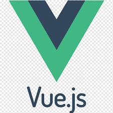

<h1 align="center">
  
</h1>

<h5 align="center">
  <code><a href="https://www.linkedin.com/in/jsayandip2003/" title="LinkedIn Profile"> LinkedIn</a></code>
  <code><a href="https://www.hackerrank.com/profile/jsupriti3434" title="HackerRank Profile"> HackerRank</a></code>
  <code><a href="https://stackoverflow.com/users/23027011/sayandip-jana" title="Stack Overflow Profile"> Stack Overflow</a></code>
  <code><a href="https://www.instagram.com/sj_sayandip/?hl=en" title="Instagram Profile"> Instagram</a></code>
</h5>
 

  Hi, I'm Sayandip Jana, a Full Stack Web Developer and aspiring Data Scientist.
   
   
  🎓 I achieved 95% in my class XII Boards and 96% in class X Boards from Contai Public School.
   
   
  🎓 Currently, I'm pursuing a Bachelor of Technology (CSE) at Lovely Professional University, Punjab.
   
   
  💻 I have a passion for coding and enjoy learning new technologies.
   
   
  📚 Currently, I'm learning Machine Learning Algorithms to merge them with my projects.
   
   
  💬 Feel free to ask me anything on my <a href="https://github.com/Sayandip-Jana-1018/sj_sayandip/issues" title="GitHub Issues">GitHub page</a>.
   
  📫 You can reach me via email at <a href="mailto:jsupriti3434@gmail.com">jsupriti3434@gmail.com</a>.

<h2 align="center">🔥 Skills & Technologies 🔥</h2>
 

  <strong>Web Development:</strong>  
  <code></code>
  <code></code>
  <code></code>
  <code></code>
  <code></code>
  <code></code>
  <code></code>
  <code></code>
  <code></code>
  <code></code>
   
  <strong>Data Science & Machine Learning:</strong>  
  <code></code>
  <code></code>
  <code></code>
  <code></code>
  <code></code>
  <code></code>
  <code></code>
  <code></code>
   
  <strong>Database Technologies:</strong>  
  <code></code>
  <code></code>
  <code></code>
   
  <strong>Version Control:</strong>  
  <code></code>
  <code></code>
   
  <strong>Tools & IDEs:</strong>  
  <code></code>
  <code></code>
  <code></code>

<h2 align="center">⚡ GitHub Stats ⚡</h2>
 

  

    
    
  

          
  

    
  

   
  

<h2 align="center">👨‍💻 Projects 👨‍💻</h2>
 

  
  
  
  

<h2 align="center">📫 Reach Out to Me 📫</h2>

  <a href="mailto:jsupriti3434@gmail.com">✉️ jsupriti3434@gmail.com</a>

  

